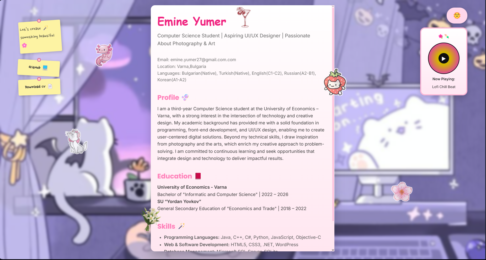
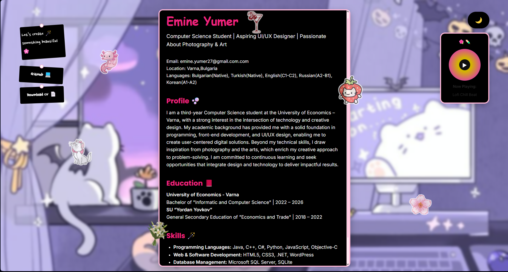

# Resume Website - Showcase

Welcome to my personal resume website! This project is a digital version of my professional resume, showcasing my skills, education, and experience. The website is designed to be interactive, visually appealing, and fun. It features a vinyl music player, a dark mode toggle, and a responsive layout to give users a unique experience while exploring my resume.

https://github.com/EmyTY/Resume.git

## Features

- **Interactive Resume**: A fun and engaging way to showcase my professional background, skills, and education.
- **Vinyl Music Player**: Soft background music for an ambient experience while viewing the resume.
- **Dark Mode Toggle**: A toggle to switch between light and dark modes for a more customizable viewing experience.
- **Responsive Design**: The website automatically adjusts to different screen sizes, ensuring it's optimized for both desktop and mobile views.
- **Fun Stickers**: Interactive stickers, such as a drink, axolotl, and cherry, add a playful element to the design.

## Technologies Used

- **HTML5**: Structure and content of the website.
- **CSS3**: Styling and layout, including the dark mode toggle and responsive design.
- **JavaScript**: Interactive elements like the vinyl music player and the dark mode toggle functionality.
- **Google Fonts**: League Script, Poppins, Nanum Pen Script, and Inter for a clean and modern look.
- **Audio**: Background music played through an embedded audio element for a relaxing atmosphere.

## License

This project is licensed under the MIT License - see the [LICENSE](LICENSE) file for details.

## Contact

Feel free to reach out to me via email at emine.umer27@gmail.com.
